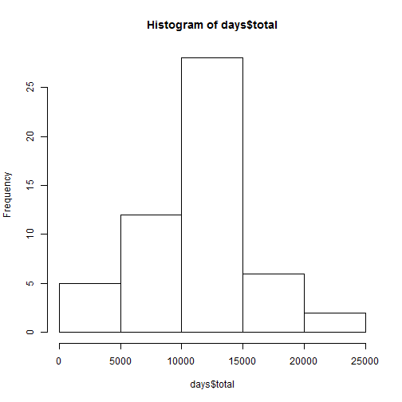
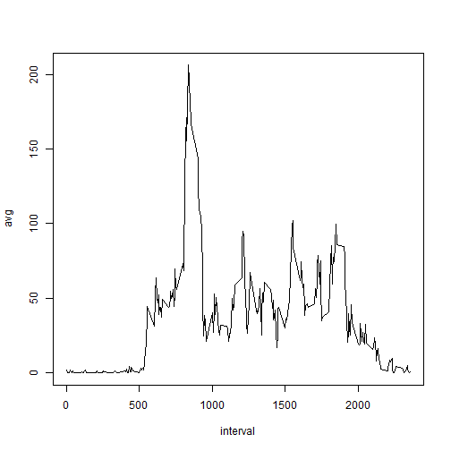
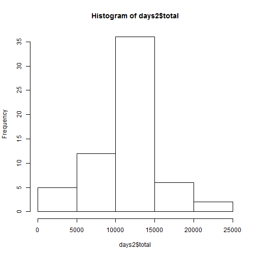
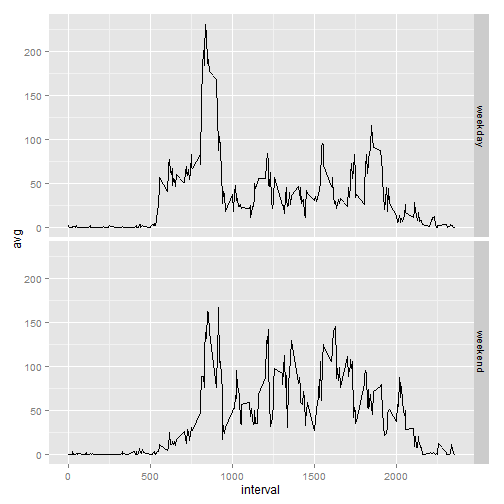

## Loading and preprocessing the data

```r
activity <- read.csv("activity/activity.csv")
library(dplyr)
activity <- mutate(activity, date = as.Date(date))
```

## What is mean total number of steps taken per day?

```r
days <- group_by(activity, date) %>% summarize(total = sum(steps))
hist(days$total)
```

 

```r
mean(days$total, na.rm=T)
```

```
## [1] 10766.19
```

```r
median(days$total, na.rm=T)
```

```
## [1] 10765
```

## What is the average daily activity pattern?

```r
intervals <- group_by(activity, interval) %>% summarize(avg = mean(steps, na.rm=T))
with(intervals, plot(interval, avg, type="l"))
```

 

```r
max.interval <- intervals[which.max(intervals$avg),]$interval
```

#### Maximum interval is: 835

## Imputing missing values

```r
missing <- activity %>% filter(is.na(steps)) %>% summarize(n())
```
2304 values are missing.  We will replace them with the average value for that time interval.  I chose average (mean) because median and mean are so close and because I already have average calculated.

```r
activity2 <- left_join(activity, intervals, by="interval") %>% 
  mutate(steps = ifelse(is.na(steps),avg, steps)) %>%
  select(-avg)
  
days2 <- group_by(activity2, date) %>% summarize(total = sum(steps))
hist(days2$total)
```

 

```r
mean(days2$total, na.rm=T)
```

```
## [1] 10766.19
```

```r
median(days2$total, na.rm=T)
```

```
## [1] 10766.19
```


## Are there differences in activity patterns between weekdays and weekends?

```r
library(chron)
intervals2 <- activity2 %>% 
  mutate(daytype = factor(ifelse(is.weekend(date), "weekend", "weekday"))) %>%
  group_by(daytype, interval) %>%
  summarize(avg = mean(steps))
library(ggplot2)
ggplot(intervals2, aes(interval, avg)) + geom_line() + facet_grid(daytype ~ .)
```

 
